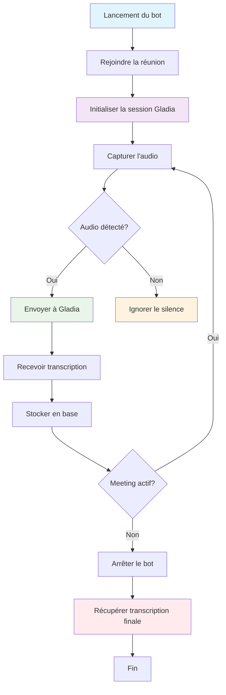

# Vexa Bot API Documentation

## 📋 Table des matières

- [Vue d'ensemble](#vue-densemble)
- [Authentification](#authentification)
- [Statut des endpoints](#statut-des-endpoints)
- [Cycle de vie de l'application](#cycle-de-vie-de-lapplication)
- [Endpoints](#endpoints)
  - [Bot Management](#bot-management)
  - [Monitoring](#monitoring)
  - [Transcriptions](#transcriptions)
  - [Administration](#administration)

## 🌟 Vue d'ensemble

L'API Vexa Bot permet de gérer des bots de transcription qui rejoignent automatiquement des réunions Google Meet, captent l'audio et génèrent des transcriptions en temps réel via l'API Gladia.

### Services disponibles

- **Bot Launcher** : http://localhost:8081 - Interface web pour lancer des bots
- **Log Monitor** : http://localhost:8082 - Monitoring en temps réel des bots
- **Transcript Retriever** : http://localhost:8083 - Récupération des transcriptions
- **API Gateway** : http://localhost:8056 - Point d'entrée principal de l'API

## 🔐 Authentification

Tous les endpoints nécessitent une authentification via l'en-tête `X-API-Key`.

```bash
curl -H "X-API-Key: YOUR_API_KEY" http://localhost:8056/bots/status
```

## ✅ Statut des endpoints

### 🟢 Endpoints fonctionnels

- `POST /bots` - Lancer un bot ✅
- `GET /bots/status` - Statut des bots ✅
- `DELETE /bots/{platform}/{native_meeting_id}` - Arrêter un bot ✅
- `PUT /bots/{platform}/{native_meeting_id}/config` - Configurer un bot ✅
- `GET /meetings/{meeting_id}` - Détails d'une réunion ✅
- `POST /retrieve` (Transcript Retriever) - Récupérer une transcription ✅
- `PUT /user/webhook` - Définir un webhook utilisateur ✅
- `POST /admin/users` - Créer un utilisateur ✅
- `POST /admin/users/{user_id}/tokens` - Créer un token API ✅
- `GET /admin/users` - Lister les utilisateurs ✅

## 🔄 Cycle de vie de l'application



### Étapes détaillées

1. **Lancement** : L'utilisateur lance un bot via l'API ou l'interface web
2. **Connexion** : Le bot rejoint automatiquement la réunion Google Meet
3. **Initialisation** : Création d'une session Gladia pour la transcription
4. **Capture audio** : Enregistrement continu de l'audio de la réunion
5. **Filtrage** : Seuls les chunks avec du son sont envoyés à Gladia
6. **Transcription** : Gladia génère des transcriptions en temps réel
7. **Stockage** : Les données sont sauvegardées en base de données
8. **Monitoring** : Suivi en temps réel via l'interface de monitoring
9. **Récupération** : Les transcriptions peuvent être récupérées à tout moment
10. **Arrêt** : Le bot quitte automatiquement quand la réunion se termine

---

## 📡 Endpoints

### Bot Management

#### 1. Lancer un bot ✅

**Endpoint** : `POST /bots`

**Description** : Lance un nouveau bot pour rejoindre une réunion et commencer la transcription.

**Paramètres requis** :

```json
{
  "platform": "google_meet",
  "native_meeting_id": "string",
  "bot_name": "string (optionnel)"
}
```

**Réponse** :

```json
{
  "id": 1,
  "platform": "google_meet",
  "platform_specific_id": "cia-spqx-acb",
  "status": "active",
  "bot_container_id": "abc123...",
  "start_time": "2025-08-03T11:31:37.229865",
  "end_time": null,
  "data": {},
  "created_at": "2025-08-03T11:31:36.479267",
  "updated_at": "2025-08-03T11:31:36.702424",
  "user_id": 1
}
```

**Exemple** :

```bash
curl -X POST -H "Content-Type: application/json" \
  -H "X-API-Key: YOUR_API_KEY" \
  -d '{
    "platform": "google_meet",
    "native_meeting_id": "cia-spqx-acb",
    "bot_name": "VexaBot-Test"
  }' \
  http://localhost:8056/bots
```

#### 2. Obtenir le statut des bots ✅

**Endpoint** : `GET /bots/status`

**Description** : Récupère la liste de tous les bots actifs pour l'utilisateur authentifié.

**Réponse** :

```json
{
  "running_bots": [
    {
      "id": 1,
      "platform": "google_meet",
      "platform_specific_id": "cia-spqx-acb",
      "status": "active",
      "bot_container_id": "abc123...",
      "start_time": "2025-08-03T11:31:37.229865",
      "end_time": null,
      "gladia_session_id": "3039b2c0-7c71-45cf-8500-63990c823c4d"
    }
  ]
}
```

**Exemple** :

```bash
curl -H "X-API-Key: YOUR_API_KEY" \
  http://localhost:8056/bots/status
```

#### 3. Arrêter un bot ✅

**Endpoint** : `DELETE /bots/{platform}/{native_meeting_id}`

**Description** : Arrête un bot spécifique et met fin à la transcription.

**Paramètres** :

- `platform` : Plateforme de réunion (ex: `google_meet`)
- `native_meeting_id` : ID de la réunion (ex: `cia-spqx-acb`)

**Réponse** :

```json
{
  "message": "Stop request accepted and is being processed."
}
```

**Exemple** :

```bash
curl -X DELETE -H "X-API-Key: YOUR_API_KEY" \
  http://localhost:8056/bots/google_meet/cia-spqx-acb
```

#### 4. Mettre à jour la configuration d'un bot ✅

**Endpoint** : `PUT /bots/{platform}/{native_meeting_id}/config`

**Description** : Met à jour la configuration d'un bot actif (langue, tâche).

**Paramètres** :

- `platform` : Plateforme de réunion
- `native_meeting_id` : ID de la réunion

**Body** :

```json
{
  "language": "fr",
  "task": "transcribe"
}
```

**Réponse** :

```json
{
  "message": "Configuration update sent to bot."
}
```

**Exemple** :

```bash
curl -X PUT -H "Content-Type: application/json" \
  -H "X-API-Key: YOUR_API_KEY" \
  -d '{"language": "fr", "task": "transcribe"}' \
  http://localhost:8056/bots/google_meet/cia-spqx-acb/config
```

### Monitoring

#### 5. Obtenir les logs des bots ✅

**Endpoint** : `GET /logs/bot` (Log Monitor)

**Description** : Récupère les logs en temps réel de tous les bots actifs.

**Réponse** :

```json
{
  "bots": [
    {
      "container": "vexa-bot-5-f59dfcdf",
      "meeting_id": "5 (cia-spqx-acb)",
      "status": "Up 2 minutes",
      "gladia_session": "afa0be66-1f5d-4937-bba0-6a27ee0cd6aa",
      "logs": "[BotCore] Audio chunk sent: 1486 samples..."
    }
  ]
}
```

**Exemple** :

```bash
curl http://localhost:8082/logs/bot
```

#### 6. Obtenir les détails d'une réunion ✅

**Endpoint** : `GET /meetings/{meeting_id}`

**Description** : Récupère les détails complets d'une réunion spécifique.

**Paramètres** :

- `meeting_id` : ID interne de la réunion

**Réponse** :

```json
{
  "id": 5,
  "platform": "google_meet",
  "platform_specific_id": "cia-spqx-acb",
  "status": "active",
  "gladia_session_id": "afa0be66-1f5d-4937-bba0-6a27ee0cd6aa",
  "start_time": "2025-08-03T11:43:12.015572",
  "end_time": null,
  "data": {}
}
```

**Exemple** :

```bash
curl -H "X-API-Key: YOUR_API_KEY" \
  http://localhost:8056/meetings/5
```

### Meetings

#### 6. Lister les réunions de l'utilisateur ✅

**Endpoint** : `GET /meetings`

**Description** : Retourne la liste des réunions de l'utilisateur. La transcription n'est PAS incluse dans cette réponse.

**Réponse** :

```json
[
  {
    "id": 7,
    "platform": "google_meet",
    "platform_specific_id": "xbj-ubib-feg",
    "status": "completed",
    "gladia_session_id": "03e4540b-278a-439d-a288-3ddb6ac44c01",
    "start_time": "2025-08-04T09:53:32.271961",
    "end_time": "2025-08-04T09:54:19.926465",
    "data": {}
  }
]
```

> Pour récupérer la transcription, utilisez l'endpoint du Transcript Retriever (`POST /retrieve`) avec un `session_id` (ou l'UUID Gladia), ou l'endpoint de transcript par meeting si disponible.

#### 7. Détails d'une réunion ✅

**Endpoint** : `GET /meetings/{meeting_id}`

**Description** : Détaille une réunion spécifique. La transcription n'est PAS incluse; utiliser `POST /retrieve` pour le texte.

—

### Transcriptions

#### 8. Récupérer une transcription ✅

**Endpoint** : `POST /retrieve` (Transcript Retriever)

**Description** : Récupère la transcription complète d'une session.

**Paramètres requis** :

```json
{
  "session_id": "string"
}
```

- `session_id` peut être:
  - l'UUID Gladia de la session (ex: `03e4540b-278a-439d-a288-3ddb6ac44c01`), ou
  - l'ID interne de la réunion (le champ `id` renvoyé par `GET /meetings`), par exemple:

```json
[
  {
    "id": 7,
    "user_id": 1,
    "platform": "google_meet",
    "native_meeting_id": "xbj-ubib-feg",
    "constructed_meeting_url": "https://meet.google.com/xbj-ubib-feg",
    "status": "active",
    "bot_container_id": "a0c9955dd2208db849f1c6d8f202e9ed928836715a0dfcfa0720881e5a12ef7c",
    "start_time": "2025-08-04T09:53:32.271961",
    "end_time": null,
    "data": {},
    "created_at": "2025-08-04T09:53:32.089622",
    "updated_at": "2025-08-04T09:53:32.093324"
  }
]
```

**Réponse** :

```json
{
  "raw_result": {
    "id": "0c974557-cd61-44f2-aa13-9736b44f4b5a",
    "status": "processing",
    "transcript_text": "Bonjour, je suis content d'être ici...",
    "utterances": [
      {
        "start": 0.0,
        "end": 2.5,
        "text": "Bonjour, je suis content d'être ici",
        "speaker": "speaker_1"
      }
    ],
    "session_info": {
      "audio_duration": 120.5,
      "session_id": "0c974557-cd61-44f2-aa13-9736b44f4b5a"
    }
  }
}
```

> Note: Ni `GET /meetings` ni `GET /meetings/{meeting_id}` ne renvoient le texte de la transcription. Utilisez cet endpoint `POST /retrieve` (ou un endpoint `/transcripts/...` si actif) pour obtenir le contenu.

**Exemple** :

```bash
curl -X POST -H "Content-Type: application/json" \
  -d '{"session_id": "5"}' \
  http://localhost:8083/retrieve
```

### Administration

#### 10. Créer un utilisateur (Admin) ✅

**Endpoint** : `POST /admin/users`

**Description** : Crée un nouvel utilisateur (nécessite X-Admin-API-Key).

**Paramètres requis** :

```json
{
  "email": "user@example.com",
  "name": "John Doe",
  "max_concurrent_bots": 5
}
```

**Réponse** :

```json
{
  "id": 2,
  "email": "user@example.com",
  "name": "John Doe",
  "max_concurrent_bots": 5,
  "created_at": "2025-08-03T11:00:00.000000"
}
```

**Exemple** :

```bash
curl -X POST -H "Content-Type: application/json" \
  -H "X-Admin-API-Key: ADMIN_API_KEY" \
  -d '{
    "email": "user@example.com",
    "name": "John Doe",
    "max_concurrent_bots": 5
  }' \
  http://localhost:8056/admin/users
```

#### 11. Créer un token API (Admin) ✅

**Endpoint** : `POST /admin/users/{user_id}/tokens`

**Description** : Crée un nouveau token API pour un utilisateur.

**Paramètres** :

- `user_id` : ID de l'utilisateur

**Réponse** :

```json
{
  "token": "LwcEO2aYXKqk6aeiubY3C4rsjOKCHuGP5uv3whfu",
  "user_id": 2,
  "created_at": "2025-08-03T11:00:00.000000"
}
```

**Exemple** :

```bash
curl -X POST -H "X-Admin-API-Key: ADMIN_API_KEY" \
  http://localhost:8056/admin/users/2/tokens
```

#### 12. Lister les utilisateurs (Admin) ✅

**Endpoint** : `GET /admin/users`

**Description** : Récupère la liste de tous les utilisateurs.

**Réponse** :

```json
{
  "users": [
    {
      "id": 1,
      "email": "admin@example.com",
      "name": "Admin User",
      "max_concurrent_bots": 10,
      "created_at": "2025-08-03T10:00:00.000000"
    }
  ]
}
```

**Exemple** :

```bash
curl -H "X-Admin-API-Key: ADMIN_API_KEY" \
  http://localhost:8056/admin/users
```

#### 13. Définir un webhook utilisateur ✅

**Endpoint** : `PUT /user/webhook`

**Description** : Définit une URL de webhook pour l'utilisateur authentifié pour recevoir des notifications.

**Paramètres requis** :

```json
{
  "webhook_url": "https://example.com/webhook"
}
```

**Réponse** :

```json
{
  "id": 1,
  "email": "admin@vexa.com",
  "name": "Admin User",
  "image_url": null,
  "max_concurrent_bots": 1,
  "data": {
    "webhook_url": "https://example.com/webhook"
  },
  "created_at": "2025-08-03T11:19:46.920509"
}
```

**Exemple** :

```bash
curl -X PUT -H "Content-Type: application/json" \
  -H "X-API-Key: YOUR_API_KEY" \
  -d '{"webhook_url": "https://example.com/webhook"}' \
  http://localhost:8056/user/webhook
```

#### 14. Webhook n8n automatique ✅

**Description** : Le système envoie automatiquement un webhook à n8n quand un bot quitte un meeting.

**Configuration** : Ajouter dans le fichier `.env` :

```bash
N8N_WEBHOOK_URL=https://your-n8n-instance.com/webhook/vexa-bot-exit
```

**Données envoyées** :

```json
{
  "meeting_id": 2,
  "platform": "google_meet",
  "native_meeting_id": "test-meeting-456",
  "user_id": 2,
  "status": "completed",
  "start_time": "2025-08-04T04:45:47.030813",
  "end_time": "2025-08-04T04:46:02.038136"
}
```

**Utilisation dans n8n** :
- Récupérer la transcription via : `GET /transcripts/{platform}/{native_meeting_id}`
- Authentification : Configurer l'API key dans n8n
- URL de base : Configurer l'URL de l'API gateway dans n8n

---

## 🚀 Workflow typique

### 1. Configuration initiale (Admin)

```bash
# 1. Créer un utilisateur
curl -X POST -H "Content-Type: application/json" \
  -H "X-Admin-API-Key: ADMIN_API_KEY" \
  -d '{"email": "user@example.com", "name": "Test User"}' \
  http://localhost:8056/admin/users

# 2. Créer un token API
curl -X POST -H "X-Admin-API-Key: ADMIN_API_KEY" \
  http://localhost:8056/admin/users/1/tokens
```

### 2. Utilisation normale

```bash
# 1. Lancer un bot
curl -X POST -H "Content-Type: application/json" \
  -H "X-API-Key: YOUR_API_KEY" \
  -d '{"platform": "google_meet", "native_meeting_id": "cia-spqx-acb"}' \
  http://localhost:8056/bots

# 2. Monitorer les logs
curl http://localhost:8082/logs/bot

# 3. Récupérer la transcription
curl -X POST -H "Content-Type: application/json" \
  -d '{"session_id": "1"}' \
  http://localhost:8083/retrieve

# 4. Arrêter le bot
curl -X DELETE -H "X-API-Key: YOUR_API_KEY" \
  http://localhost:8056/bots/google_meet/cia-spqx-acb
```

---

## 📊 Codes de statut

- `200` : Succès
- `201` : Créé avec succès
- `202` : Accepté (traitement en cours)
- `400` : Requête invalide
- `401` : Non autorisé
- `403` : Interdit (token invalide)
- `404` : Non trouvé
- `500` : Erreur serveur

---

## 🔧 Variables d'environnement

```bash
# API Keys
API_KEY=LwcEO2aYXKqk6aeiubY3C4rsjOKCHuGP5uv3whfu
ADMIN_API_KEY=your_admin_api_key
GLADIA_API_KEY=your_gladia_api_key

# URLs des services
API_GATEWAY_URL=http://api-gateway:8000
BOT_MANAGER_URL=http://bot-manager:8080
ADMIN_API_URL=http://admin-api:8001

# Logs bot (optionnel)
# Répertoire ABSOLU côté host pour stocker les logs par appel
BOT_LOGS_HOST_DIR=/absolute/path/on/host/vexa-bot-logs
LOG_LEVEL=INFO

# Keep-Alive audio (optionnel)
# Micro-chunk silencieux envoyé toutes les X ms pour garder la session Gladia active
# 0 = désactivé (par défaut)
KEEP_ALIVE_INTERVAL_MS=0

# Configuration webhook n8n (optionnel)
N8N_WEBHOOK_URL=https://your-n8n-instance.com/webhook/vexa-bot-exit
```

---

## 📝 Notes importantes

1. **Limite de bots concurrents** : Chaque utilisateur a une limite configurable de bots simultanés
2. **Filtrage du silence** : Les chunks audio silencieux sont automatiquement ignorés
3. **Sessions Gladia** : Chaque bot crée une session Gladia unique pour la transcription. Un keep-alive audio optionnel
   peut être activé via `KEEP_ALIVE_INTERVAL_MS` pour éviter des sessions `audio_duration = 0` en cas de longue attente.
4. **Monitoring temps réel** : Les logs sont mis à jour automatiquement
5. **Transcriptions persistantes** : Les données sont sauvegardées en base de données. Les logs par appel sont stockés
   sous forme de fichiers si `BOT_LOGS_HOST_DIR` est défini (un fichier par connectionId).
6. **Endpoints non fonctionnels** : Certains endpoints dépendent du service transcription-collector supprimé

---

## 🆘 Support

Pour toute question ou problème :

- Vérifiez les logs du monitoring : http://localhost:8082
- Consultez la documentation Gladia : https://docs.gladia.io
- Vérifiez le statut des services : `docker-compose ps`
